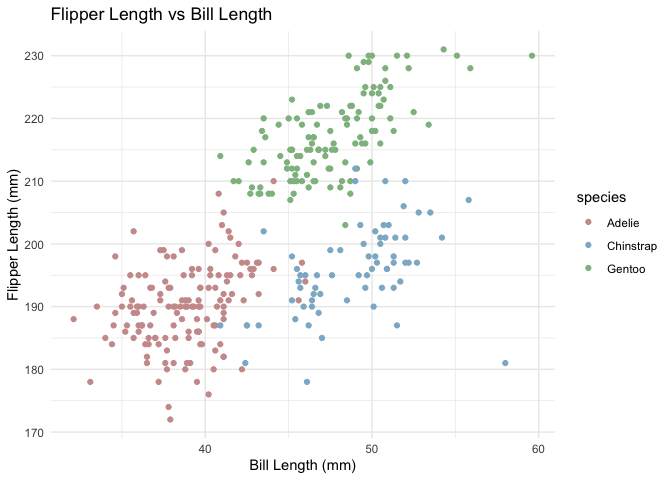

p1805_hw1_yc4588
================
Yining Cao
2024-09-19

- [Problem1](#problem1)
  - [Load the penguins dataset](#load-the-penguins-dataset)
  - [Scatterplot of flipper Length(mm) vs bill Length(mm) for
    penguins](#scatterplot-of-flipper-lengthmm-vs-bill-lengthmm-for-penguins)
- [Problem2](#problem2)
  - [Create a data frame](#create-a-data-frame)
  - [Calculate the mean of the number
    column](#calculate-the-mean-of-the-number-column)
  - [Convert variables to numeric](#convert-variables-to-numeric)

# Problem1

## Load the penguins dataset

``` r
data("penguins", package = "palmerpenguins")
summary(penguins)
```

    ##       species          island    bill_length_mm  bill_depth_mm  
    ##  Adelie   :152   Biscoe   :168   Min.   :32.10   Min.   :13.10  
    ##  Chinstrap: 68   Dream    :124   1st Qu.:39.23   1st Qu.:15.60  
    ##  Gentoo   :124   Torgersen: 52   Median :44.45   Median :17.30  
    ##                                  Mean   :43.92   Mean   :17.15  
    ##                                  3rd Qu.:48.50   3rd Qu.:18.70  
    ##                                  Max.   :59.60   Max.   :21.50  
    ##                                  NA's   :2       NA's   :2      
    ##  flipper_length_mm  body_mass_g       sex           year     
    ##  Min.   :172.0     Min.   :2700   female:165   Min.   :2007  
    ##  1st Qu.:190.0     1st Qu.:3550   male  :168   1st Qu.:2007  
    ##  Median :197.0     Median :4050   NA's  : 11   Median :2008  
    ##  Mean   :200.9     Mean   :4202                Mean   :2008  
    ##  3rd Qu.:213.0     3rd Qu.:4750                3rd Qu.:2009  
    ##  Max.   :231.0     Max.   :6300                Max.   :2009  
    ##  NA's   :2         NA's   :2

``` r
nrow(penguins) # the number of rows
```

    ## [1] 344

``` r
ncol(penguins) # the number of columns
```

    ## [1] 8

- The main variables in the dataset include:

1.  *species*: The species of the penguins, including Adelie(152),
    Chinstrap(68) and Gentoo(124).
2.  *island*: The islands inhabited by penguins are Biscoe(168),
    Dream(124) and Torgersen(52).
3.  *bill_length_mm*: The length of the penguin’s bill in
    millimeters(32.10-59.60).
4.  *bill_depth_mm*: The depth of the penguin’s bill in
    millimeters(13.10-21.50).
5.  *flipper_length_mm*: The length of the penguin’s flippers in
    millimeters(172.0-231.0).
6.  *body_mass_g*: The body mass of the penguins in grams(2700-6300).
7.  *year*: The year of the penguins, including 2007, 2008 and 2009.
8.  *sex*: The sex of the penguins, including 165 female penguins and
    168 male penguins.

- This dataset contains 344 rows and 8 columns.
- The mean flipper length for the penguins is 200.92 mm.

## Scatterplot of flipper Length(mm) vs bill Length(mm) for penguins

``` r
library(ggplot2)
p1 = ggplot(na.omit(penguins), aes(x = bill_length_mm, y = flipper_length_mm, color = species)) +
  geom_point() +  
  scale_color_manual(values = c("Adelie" = "#CD9B9B", "Chinstrap" = "#8DB6CD", "Gentoo" = "#8FBC8F")) +
  labs(title = "Flipper Length vs Bill Length",
       x = "Bill Length (mm)",
       y = "Flipper Length (mm)") +
  theme_minimal()
p1
```

<!-- -->

``` r
ggsave(filename = "penguins_scatterplot.png", plot = p1, width = 10, height = 7, dpi = 300)
```

- The scatterplot shows the relationship between bill length and flipper
  length of penguins from different islands.
- Gentoo penguins generally have longer flippers, while Chinstrap and
  Adelie penguins have shorter bill and flipper lengths.

# Problem2

## Create a data frame

``` r
library(tibble)
set.seed(123)
df <- tibble(
  number = rnorm(10),
  logical_vector = rnorm(10) > 0,
  character_vector = sample(c("A", "B", "C", "D", "E"), 10, replace = TRUE),
  factor_vector = factor(sample(c("Level1", "Level2", "Level3"), 10, replace = TRUE))
)
```

## Calculate the mean of the number column

``` r
library(dplyr)
```

    ## 
    ## Attaching package: 'dplyr'

    ## The following objects are masked from 'package:stats':
    ## 
    ##     filter, lag

    ## The following objects are masked from 'package:base':
    ## 
    ##     intersect, setdiff, setequal, union

``` r
number_mean = df %>% 
  pull(number) %>%
  mean()
number_mean
```

    ## [1] 0.07462564

``` r
logical_vector_mean = df %>% 
  pull(logical_vector) %>%
  mean()
logical_vector_mean
```

    ## [1] 0.7

``` r
character_vector_mean = df %>% 
  pull(character_vector) %>%
  mean()
```

    ## Warning in mean.default(.): argument is not numeric or logical: returning NA

``` r
character_vector_mean
```

    ## [1] NA

``` r
factor_vector_mean = df %>% 
  pull(factor_vector) %>%
  mean()
```

    ## Warning in mean.default(.): argument is not numeric or logical: returning NA

``` r
factor_vector_mean
```

    ## [1] NA

- Means can be calculated for numeric and logical variables.
- Factor and character variables cannot be averaged.

## Convert variables to numeric

``` r
logical_vector = as.numeric(df$logical_vector)
character_vector = as.numeric(df$character_vector)
factor_vector = as.numeric(df$factor_vector)
```

- NA values were introduced due to characters can not be converted to
  numeric, so characters can not take the mean.
- Factor variable can be converted to numeric without any warning,
  level1 is converted to 1, level2 is converted to 2, and level3 is
  converted to 3 so that it can be used in the calculation.
